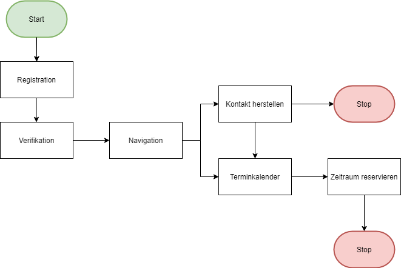

# Projektbeschreibung

## Ausgangslage:
Auf meinem Anwesen steht ein Tennisplatz in sehr gutem Zustand. Da ich selber kein Tennis spiele, möchte ich in Zukunft diesen Tennisplatz an Interessierte vermieten. Dieser Tennisplatz eignet sich besonders gut, da man beim Spielen eine wunderschöne Aussicht auf die Stadt hat.

## Funktion/Projektidee:
Damit ich mein Vorhaben umsetzen kann, habe ich geplant eine Webapplikation zu erstellen, mit der Nutzer online ganz bequem einen Termin reinbuchen können. Die Applikation zeigt natürlich auch an, ob der gewünschte Termin frei ist oder bereits besetzt. So habe ich für meinen Tennisplatz einen öffentlichen Kalender und brauche mich selbst nicht um die Reservation zu kümmern. Zu Beginn muss sich jeder Nutzer registrieren und verifizieren.

Nach dem Erstellen des Accounts - Navigation:
Terminkalender
Preise
Kontakt

## Workflow:
### Dateneingabe:
Nutzer geben bei der Registration ihre persönlichen Daten ein: Name, Adresse, Telefonnummer und legen so ihren Account an.

Terminkalender:
Nutzer wählen einen Zeitraum im Kalender aus.

Preise:
Keine Dateneingabe

Kontakt:
Möglichkeit eine Nachricht einzugeben.

### Datenverarbeitung/Speicherung:
Persönliche Daten werden bei der Registration gespeichert.

Terminkalender:
Gewünschte Zeitraum wird blockiert bzw. reserviert.

Preise:
Keine Verarbeitung

Kontakt:
Eingegebene Nachricht wird gespeichert.

### Datenausgabe:
Terminkalender:
Der Kalender gibt aus, dass die Terminbuchung erfolgreich war und blockiert den Zeitraum.

Kontakt:
Nachricht wird an mich weitergeleitet.

Mein Ablaufdiagramm:
